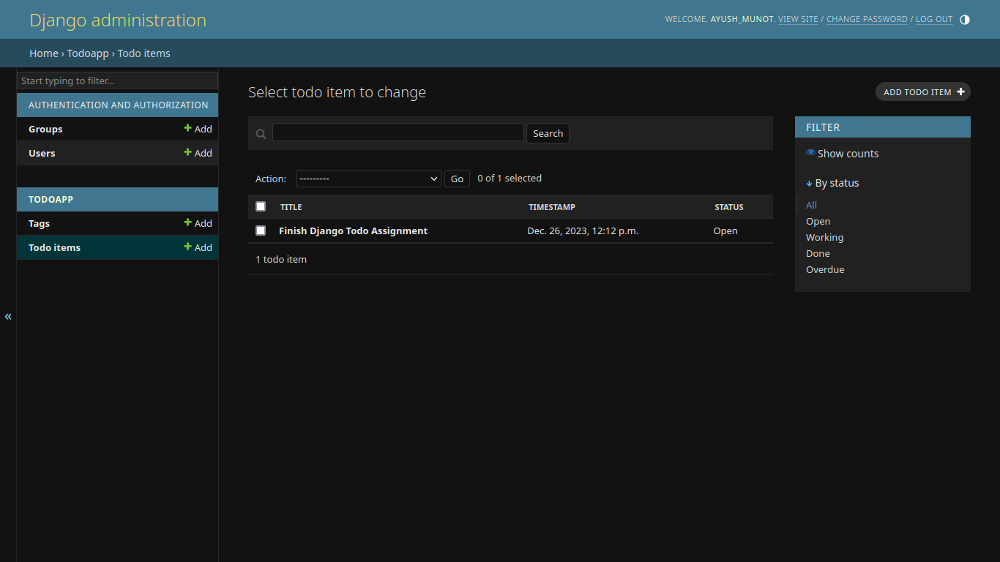
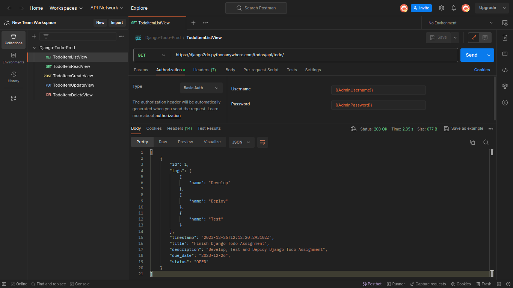

# Django Todo List App

This Django application allows users to create, manage, and track tasks with a powerful Todo List interface.

## Features

- **Task Management**: Create, update, and delete tasks with due dates and descriptions.
- **Tagging**: Assign tags to tasks for better organization and filtering.
- **Status Tracking**: Monitor the status of tasks with options like OPEN, WORKING, DONE, and OVERDUE.
- **RESTful APIs**: Access endpoints for creating, reading, updating, and deleting Todo items.

## Installation

### Steps

1. Clone the repository:

    ```bash
    git clone https://github.com/RoyalBosS-Ayush/Django-Todo-Backend.git
    ```

2. Navigate to the project directory:

    ```bash
    cd Django-Todo-Backend
    ```

3. Install dependencies:

    ```bash
    pip install -r requirements.txt
    ```

4. Apply migrations:

    ```bash
    python manage.py migrate
    ```

5. Run the development server:

    ```bash
    python manage.py runserver
    ```

6. Access the application at `http://127.0.0.1:8000/`.

## Usage

1. Create a superuser:

    ```bash
    python manage.py createsuperuser
    ```

2. Access the Django Admin interface at `http://127.0.0.1:8000/admin/` to manage Todo items.

3. Utilize the REST APIs to interact programmatically with the application.

## Testing

To run tests:

```bash
python manage.py test todoapp
```

## Admin Preview





## Postman Preview




## Coverage Report


